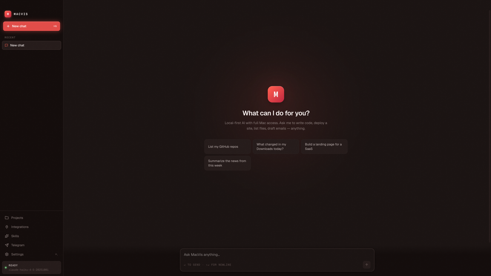
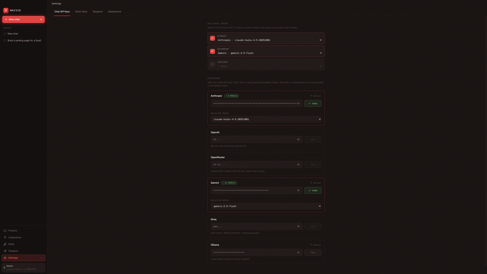
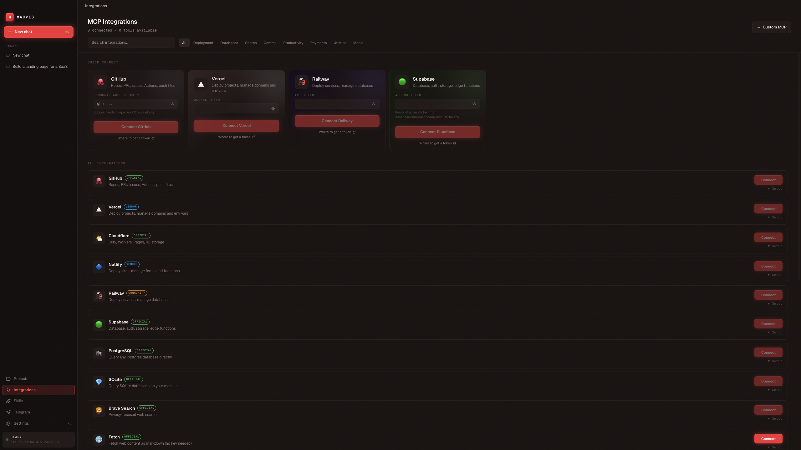

<div align="center">

# MacVis — open-source local-first AI agent for macOS

**A free desktop AI assistant for Mac with full system access, multi-provider model routing (Claude / GPT / Gemini / Ollama), and Model Context Protocol (MCP) integrations.**

🌐 **Website:** [asim266.github.io/macvis](https://asim266.github.io/macvis/) · 📦 **Download:** [latest .dmg release](https://github.com/asim266/macvis/releases/latest)

Bring-your-own-key. Multi-provider. No backend. No telemetry. Full Mac access.

[](LICENSE)
[](#)
[](#)
[](#multi-provider-with-fallback)

</div>

> *Like Claude Desktop or ChatGPT for Mac — but you own the agent, your data, and the model choice.*

## Download

<div align="center">

**[⬇ Download the latest .dmg](https://github.com/asim266/macvis/releases/latest)**

</div>

The app is not code-signed yet, so on first launch macOS will warn you. Right-click the app → **Open** → **Open Anyway**. (Or run `xattr -d com.apple.quarantine /Applications/MacVis.app` once.)

Prefer to build from source? See [Quick Start](#quick-start) below.

---

## What is MacVis?

MacVis is a native macOS desktop assistant that runs the same kind of agentic loop you get from Claude or ChatGPT — only it lives entirely on your machine. The agent has full access to **bash**, your **filesystem**, **web search**, and your **developer platforms** via MCP. Every chat, every project, every API key stays on your Mac.

Built for developers who want a real agent to drive their environment, without sending their workspace to a third party.

## Highlights

- 🧠 **Multi-provider with fallback** — pick a primary, secondary, and tertiary model. If the primary rate-limits or errors out, MacVis automatically falls back to the next.
- 🔑 **6 providers, BYOK** — Anthropic (Claude), OpenAI (GPT), OpenRouter (200+ models), Google Gemini, Groq (fast Llama/Mixtral), Ollama (local).
- ✅ **Live key validation** — every key has a one-click *Test* button that hits the provider's `/models` endpoint and pulls in the actual model list you have access to.
- 💾 **Persistent memory** — every chat is saved to `~/.macvis/sessions/`. Reopen the app and your history is there. The agent remembers what it built in prior turns.
- 📁 **Projects view** — every code project the agent creates goes to `~/.macvis/workspace/projects/` and shows up in a dedicated Projects page with one-click *Open in Browser / Editor / Finder* plus *Run* for HTML/Node/Next/Python projects.
- 🔌 **MCP-ready** — first-class config for GitHub, Supabase, Vercel, Railway, Slack, Cloudflare, Netlify, Stripe (Phase 4 wires up live connections).
- 📡 **Telegram remote** — single-user-gated bot for full agent access from your phone (Phase 7).
- 🚫 **No database, no telemetry** — everything is flat JSON in `~/.macvis/`. Inspect, back up, sync — you own it.
- 🎨 **Distinctive UI** — refined dark theme with warm-red accent, Geist typography, OKLCH-based design tokens. Inspired by Linear and Raycast.

## Screenshots

<div align="center">



*The empty chat — bold logomark, quick-prompt chips, and the agent ready to act.*

<br/><br/>


*Tool calls render inline as terminal-style cards. Here the agent builds a SaaS landing page end-to-end, writing the HTML/CSS/JS itself.*

<br/><br/>



*Chat API Keys — Anthropic primary + Gemini secondary fallback chain. Click* ***Test*** *and MacVis pulls the real model list from each provider.*

<br/><br/>



*MCP Integrations — Quick Connect cards for GitHub / Vercel / Railway / Supabase, plus a catalog of 18 more (Cloudflare, Postgres, Slack, Linear, Notion, Stripe, …) and a Custom MCP option for anything else.*

</div>

## Multi-provider with fallback

MacVis routes every chat turn through a configurable **fallback chain** of up to 3 model providers:

```
┌──────────────┐    ┌──────────────┐    ┌──────────────┐
│  Primary     │ ─▶ │  Secondary   │ ─▶ │  Tertiary    │
│  (try first) │    │  (on fail)   │    │  (last resort)│
└──────────────┘    └──────────────┘    └──────────────┘
```

Set them in **Settings → Chat API Keys → Fallback Chain**. Examples:

| Use case | Chain |
|---|---|
| Highest quality with safety net | Anthropic Opus → OpenAI GPT-5 → OpenRouter Sonnet |
| Cheap + cheerful | Groq Llama → Gemini Flash → OpenAI Mini |
| Offline-friendly | Ollama → Anthropic Haiku → OpenRouter |

**Supported providers:**

| Provider | Models | Where to get a key |
|---|---|---|
| **Anthropic** | Claude 4.5 family (Opus, Sonnet, Haiku) | [console.anthropic.com](https://console.anthropic.com/) |
| **OpenAI** | GPT-5, GPT-4o, o-series | [platform.openai.com](https://platform.openai.com/api-keys) |
| **OpenRouter** | 200+ models, one key | [openrouter.ai/keys](https://openrouter.ai/keys) |
| **Google Gemini** | Gemini 2.5 Pro / Flash | [aistudio.google.com/apikey](https://aistudio.google.com/apikey) |
| **Groq** | Llama 3.3, Mixtral (very fast) | [console.groq.com](https://console.groq.com/keys) |
| **Ollama** | Anything you've pulled locally | install [Ollama](https://ollama.com), no key required |

## Quick Start

### Prerequisites

- macOS 13 or newer
- [Node.js](https://nodejs.org) 20+
- [pnpm](https://pnpm.io/installation)

### Run from source

```bash
git clone https://github.com/asim266/macvis.git
cd macvis
pnpm install
pnpm dev
```

The window opens, you go to **Settings → Chat API Keys**, paste at least one key (Anthropic recommended), click *Test*, pick a model, and you're live.

### Your first session

1. **Settings → Chat API Keys** → paste an API key → click **Test** → pick a model
2. *(Optional)* Add a second provider for the **Fallback Chain** so retries are automatic
3. Go to **Chat** and try one of:
   - *"Create a Next.js todo app called my-todo"*
   - *"Build a landing page for a SaaS"*
   - *"List my Downloads folder"*
   - *"What's the disk space on this machine?"*
4. Check the **Projects** tab — anything code-shaped that the agent creates lands here automatically

## Tech Stack

| Layer | Choice |
|---|---|
| Runtime | Electron 41 |
| Bundler | electron-vite 5 + Vite 8 |
| UI | React 18 + TypeScript |
| Styling | Tailwind v4 + OKLCH design tokens |
| Typography | Geist Sans + Geist Mono |
| State | Zustand |
| Config store | `conf` → `~/Library/Application Support/macvis/config.json` |
| Model SDKs | `@anthropic-ai/sdk`, `openai`, `@google/generative-ai` |
| Package manager | pnpm |

## Architecture

```
~/.macvis/                       ← user data (BYOK home)
├── sessions/                    ← persisted chat history (JSON per session)
│   └── <session-id>.json
├── workspace/projects/          ← code projects the agent creates
│   └── <project-name>/
└── skills/                      ← installable skill packs (Phase 6)

macvis/                          ← this repo
├── electron/                    ← Node.js main process
│   ├── core/
│   │   ├── agent/
│   │   │   ├── providers/       ← Provider abstraction
│   │   │   │   ├── AnthropicProvider.ts
│   │   │   │   ├── OpenAIProvider.ts   (OpenAI, OpenRouter, Groq, Ollama)
│   │   │   │   └── GeminiProvider.ts
│   │   │   ├── AgentLoop.ts     ← Streaming loop + fallback router
│   │   │   ├── ToolBuilder.ts
│   │   │   └── ProviderValidator.ts
│   │   ├── tools/               ← bash, filesystem, web search
│   │   ├── sessions/            ← persistent chat history
│   │   ├── projects/            ← project scanner + runner
│   │   ├── config/              ← conf wrapper
│   │   ├── mcp/                 ← MCP client manager (Phase 4)
│   │   ├── skills/              ← skill loader (Phase 6)
│   │   └── telegram/            ← Telegraf bot (Phase 7)
│   ├── ipc/                     ← One IPC handler module per domain
│   ├── main.ts                  ← BrowserWindow + app boot
│   └── preload.ts               ← contextBridge → window.macvis.*
└── src/                         ← React renderer
    ├── pages/                   ← Chat, Settings, Projects, MCPs
    ├── components/              ← layout, chat, settings, ui
    ├── stores/                  ← Zustand state
    └── App.tsx                  ← root + routing
```

The main process owns all I/O, AI calls, and tool execution. The renderer is pure UI and talks to the main process exclusively over a typed IPC bridge (`window.macvis.*`).

## Roadmap

| Phase | Status |
|---|---|
| 1. Electron shell + chat + Anthropic streaming | ✅ |
| 2. Full settings with multi-provider BYOK + validation | ✅ |
| 3. Tool system: bash, filesystem, web search, projects, memory | ✅ |
| 3b. Multi-provider routing with fallback chain | ✅ |
| 4. MCP manager — live MCP server connectivity | ✅ |
| 5. Platform integrations: GitHub, Vercel, Supabase, Railway, Slack, Stripe, Notion, Linear, … | ✅ |
| 7. Telegram remote control (single-user-gated bot) | ✅ |
| 8a. DMG packaging (arm64 + x64) | ✅ |
| 8b. Code-signing + notarization | ⏳ [#2](https://github.com/asim266/macvis/issues/2) |
| 8c. Auto-updater (electron-updater) | ⏳ [#3](https://github.com/asim266/macvis/issues/3) |
| 6. Skills loader + Web Builder skill | ⏳ [#4](https://github.com/asim266/macvis/issues/4) |
| 9. Tool-call approval mode (require OK before destructive actions) | ⏳ [#5](https://github.com/asim266/macvis/issues/5) |

**8 of 11 milestones shipped.** The remaining 3 each have a tracking issue you can pick up.

## Privacy

- All conversation data stays on your Mac (`~/.macvis/sessions/`).
- API keys are stored locally in `~/Library/Application Support/macvis/config.json`.
- Provider validation hits the providers directly from your machine; no proxy in between.
- **No analytics, no telemetry, no remote logging.** Open the network tab — every call is direct to a provider you configured.

## FAQ

**Is MacVis free?** Yes — MIT-licensed. You pay only the AI providers you choose. Or use Ollama (local Llama, Mistral, Qwen, etc.) for zero cost.

**Is there a Claude Desktop alternative for Mac that supports MCP?** Yes — MacVis is exactly that. 19 built-in MCP integrations plus a custom server form.

**Can I run an AI agent locally on my Mac without sending data to the cloud?** Yes — combine MacVis with [Ollama](https://ollama.com) for a fully local agent loop. No internet, no API keys.

**Is MacVis open source?** Yes — full source at [github.com/asim266/macvis](https://github.com/asim266/macvis). PRs welcome.

**What models does MacVis support?** Anthropic (Claude Opus / Sonnet / Haiku), OpenAI (GPT-4o, GPT-5, o-series), Google Gemini (2.5 Pro / Flash), OpenRouter (200+ models), Groq (Llama, Mixtral), Ollama (any local model).

**Does MacVis send my data anywhere?** No backend, no telemetry. Every API call goes directly from your Mac to the provider you configured. Conversations are JSON files in `~/.macvis/sessions/` on your machine.

**How is MacVis different from Cursor / Continue / Claude Code?** Those are agent surfaces embedded in your IDE. MacVis is a standalone desktop assistant — it can drive bash, Finder, Mail, deploy to Vercel, send Slack messages — not just edit code.

**Is the DMG signed?** Not yet — code-signing tracked in [#2](https://github.com/asim266/macvis/issues/2). For now, right-click → Open on first launch, or run `xattr -d com.apple.quarantine /Applications/MacVis.app`.

## Comparable projects

- **[OpenClaw](https://github.com/openclaw/openclaw)** — similar idea, web-based UI
- **Claude Desktop** — Anthropic's first-party Mac app (Claude only, no agent loop)
- **Open WebUI** — local model interface (focused on Ollama)
- **Cursor / Continue.dev** — agent in editor (different surface)

MacVis is for the case where you want a **standalone desktop agent** with multi-provider routing, persistent memory, and full Mac access — not a chat sidecar to your editor.

## Contributing

**MacVis is built in the open — contributors of every level are welcome.**

You don't need to be a TypeScript/Electron expert to help. Here are the easiest ways to start:

### 🐛 Find and report bugs
The agent has access to bash, files, MCP servers, and Telegram — there are many ways to break it. Try unusual inputs, edge cases, low-bandwidth scenarios. **Open an issue with a repro and screenshot** — that alone is a huge help. See [Finding bugs](CONTRIBUTING.md#finding-bugs) for ideas.

### ✨ Pick up an issue
- **[Good first issues →](https://github.com/asim266/macvis/labels/good%20first%20issue)** — small, scoped, well-defined
- **[Help wanted →](https://github.com/asim266/macvis/labels/help%20wanted)** — bigger items that need extra hands
- **[All open issues →](https://github.com/asim266/macvis/issues)** — pick anything that looks fun

### 🚀 Build something new
- Add a new **MCP integration** — almost mechanical, 5 minutes per provider. See [CONTRIBUTING.md → Adding a new MCP integration](CONTRIBUTING.md#adding-a-new-mcp-integration).
- Add a new **chat provider** — the `ChatProvider` interface normalizes everything.
- Build out a **roadmap phase** (skills loader, auto-updater, image gen, …).

### Dev commands
```bash
pnpm install
pnpm dev          # Electron + Vite HMR
pnpm typecheck    # tsc --noEmit (run before pushing)
pnpm build        # produces dist/MacVis-{ver}-{arch}.dmg for both architectures
```

Full guide: **[CONTRIBUTING.md](CONTRIBUTING.md)**

By contributing, you agree your contributions are licensed under [MIT](LICENSE).

## Disclaimer

**MacVis is open-source software provided "AS IS", without warranty of any kind.**

The agent has **full access to your Mac** — bash, filesystem, network, and any platforms you connect via MCP. You are giving an LLM the ability to run commands, modify files, deploy code, send messages, and spend money. **Treat it accordingly:**

- **You are responsible** for every action MacVis takes on your machine. Review tool calls before they execute, especially `bash` and anything that touches money or production systems.
- **The author(s) and contributors of MacVis are not liable** for any loss, damage, data corruption, unintended deployments, accidental expenses, deleted files, leaked credentials, or any other consequence — direct, indirect, incidental, or otherwise — arising from your use of this software.
- **You bring your own keys.** Any charges you incur on Anthropic, OpenAI, OpenRouter, Vercel, Stripe, etc. are entirely your responsibility.
- **MCP servers run as child processes** with your environment. Only connect MCPs you trust.
- **No security audit** has been performed. Do not use MacVis for handling regulated data (PHI, PII, financial, etc.) without your own review.

If you don't accept those terms, **don't run the software.** By installing or using MacVis, you accept full responsibility for its behavior on your machine.

See the [LICENSE](LICENSE) for the full MIT terms including the formal disclaimer of warranty and limitation of liability.

## License

MIT — see [LICENSE](LICENSE).

---

<div align="center">

Built by [@asim266](https://github.com/asim266) · Inspired by Claude Desktop, Linear, Raycast, and OpenClaw

⭐ **If you like MacVis, please star the repo — it really helps with discovery.**

</div>
